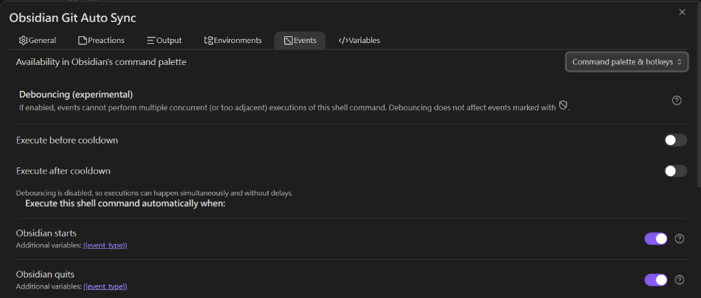

# Obsidian Git Sync (Enhanced)

A robust, cross-platform (Windows & macOS) Python script to automatically synchronize your Obsidian vault with a GitHub repository.

## New Features
- **Smart Idle Detection**: Only checks modified files, significantly improving performance for large vaults.
- **Batch Upload Support**: Automatically splits large sets of files (like initial syncs) into chunks of 500 to ensure stable uploads.
- **Robust Logging**: actions are logged to `sync.log`.
- **Auto-Initialization**: Detects if your vault is not a git repo and helps you set it up.
- **Repair Mode**: Built-in tool to fix common proxy, connection, and "unrelated history" issues.
- **Background Sync**: Can register itself on Windows Startup.

## Prerequisites
- **Python 3.x** installed.
- **Git** installed and configured.
- (Optional) A GitHub repository URL if you want to upload to the cloud.

## Installation
To use this system, you first need to download the code:
```bash
git clone https://github.com/stanley-create/Git-Sync-System
```

## Quick Start

1.  **Double-click `start.bat`**.
2.  The first time you run it, it will **ask you to enter the path** to your Obsidian Vault.
    - Example: `C:\Users\Name\Documents\MyVault`
3.  It will also ask for your GitHub repository URL (optional but recommended).
4.  **Recommended for First Sync (Large Vaults)**:
    - If you have thousands of files or created your GitHub repo with a README, it is highly recommended to select **Option 3 (Repair Connection)** in the menu.
    - This will handle initial conflicts and start the **Batch Upload** process (one commit every 500 files) to ensure a stable first upload.
5.  Once the initial sync is complete, future updates will be handled automatically by **Option 1 (Start Syncing)**.

## Run at Startup (Windows)
To have this run automatically when you log in:
1.  Open a terminal in this folder.
2.  Run: `python sync.py --install-startup`

## INTEGRATION: Run via Obsidian (Optional)
You can control this script directly from Obsidian using the **Shell Commands** plugin.

### 1. Install Plugin
1. Open Obsidian **Settings** > **Community plugins**.
2. Turn off "Restricted Mode".
3. Browse and install **Shell Commands**. Enable it.

### 2. Create Command
1. Go to **Shell Commands** settings.
2. Click **New command**.
3. In the command field, enter the **absolute path** to your `start.bat` file.
   - **Important**: Wrap the path in quotes if it has spaces.
   - Example: `cmd /c "cd /d "C:\Users\<YourName>\Git-Sync-System" && start.bat --silent"`
4. Set an alias (e.g., "Start Git Sync").

### 3. Configure Events (Triggers)
1. Click the **Events** tab (or lightning bolt icon) for that command.
2. Click **Add new event**.
3. Select **"Obsidian starts"** from the list.
4. This ensures the Python monitoring script starts as soon as you open your vault.



### 4. Run Silently (No Window)
1. Go to the **Output** tab.
2. Set **Output channel** to **"Ignore"** or **"Status bar message"**.
3. Ensure the execution is set to run in the **Background**.


### 5. Manual Sync Button (Bonus)
1. Install **Customizable Sidebar** plugin.
2. Add a new command on the sidebar: `Shell Commands: Start Git Sync`.
3. Now you have a manual sync button!

## Configuration
Settings are saved to `config.json`.
```json
{
    "repo_path": "C:\\Users\\<YourName>\\Documents\\Obsidian Vault",
    "idle_threshold": 60,
    "remote_url": "https://github.com/your/repo.git"
}
```

## Troubleshooting & Repair

If you encounter **500 errors**, **403 forbidden**, or **failed to push** errors, we have built-in tools.

### 1. Built-in Repair
In a terminal, run:
```bash
python sync.py --repair
```
**This will automatically:**
- Clear stuck Git proxy settings.
- Increase Git `postBuffer` to 500MB (allows larger file uploads).
- Reset the remote connection to GitHub.
- **Handle Unrelated Histories**: Pulls remote changes (like a GitHub README) and merges them safely.
- **Trigger Batch Upload**: Divides large pushes into sequential chunks with progress tracking.

### 2. Manual Proxy Clear
If you prefer manual fix:
```bash
git config --global --unset http.proxy
git config --global --unset https.proxy
```

### 3. Identity Issues
If Git doesn't know who you are, run:
```bash
python sync.py --setup
```

## How it Works
- **Checks changes**: Every 20 seconds.
- **Syncs**: If changes are detected and you stop typing for 60 seconds (idle), it commits and pushes.
- **Batching**: If more than 500 files are detected, it uploads them in sequential batches to prevent timeouts.
- **Conflicts**: Automatically tries `git pull --rebase` to avoid merge conflicts.
- **Resilient**: If a batch push fails, it will retry and resume progress from the last successful chunk.
